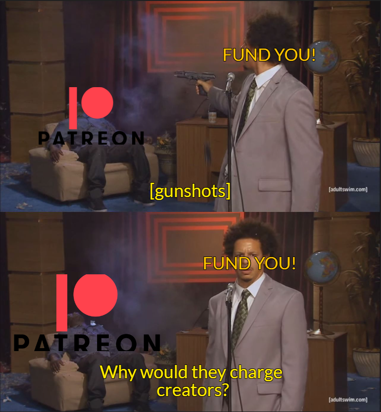

  
 

<!-- PROJECT SHIELDS -->
<!--
*** I'm using markdown "reference style" links for readability.
*** Reference links are enclosed in brackets [ ] instead of parentheses ( ).
*** See the bottom of this document for the declaration of the reference variables
*** for contributors-url, forks-url, etc. This is an optional, concise syntax you may use.
*** https://www.markdownguide.org/basic-syntax/#reference-style-links
-->
[![Contributors][contributors-shield]][contributors-url]
[![Forks][forks-shield]][forks-url]
[![Stargazers][stars-shield]][stars-url]
[![Issues][issues-shield]][issues-url]
[![MIT License][license-shield]][license-url]
[![LinkedIn][linkedin-shield]][linkedin-url]

<!-- PROJECT LOGO -->
 

  

<h3 align="center">FUND YOU!</h3>

  

    patreon killer!
     
    <a href="https://www.youtube.com/watch?v=dI91TXN9L9g"><strong>Demo Video Link! »</strong></a>
     
     
    <a href="https://devpost.com/software/FUND-YOU">Devpost Link</a>
    ·
    <a href="https://github.com/arncv/FUND-YOU/issues">Report Bug</a>
    ·
    <a href="https://github.com/arncv/FUND-YOU/issues">Request Feature</a>
  

## Built With

 
 

[![Product Name Screen Shot][product-screenshot]](https://arncv.github.io/FUND-YOU/)

## Inspiration
 Being a creator is a very tedious & expensive job. Patreon helped them monetize their content and create a community but in return charged 2.5-5% of the creator's earnings. We wanted to create a platform that would help creators monetize their content without charging them any fees. We also wanted to create a platform that would help creators connect with their fans and create a community. 
 
 

## What it does
FUND YOU is a platform that allows creators to monetize their content and connect with their fans. Creators can create a profile and post content for their fans to see. Fans can subscribe to their favorite creators and support them. Creators can also create a community for their fans to interact with each other.

## How we built it
 The website was built with HTML5, CSS3 & SASS. Along with these, we used Coil Web Monetization kit to help creator ship out their exclusive content to subscribed users.

(<a href="#readme-top">back to top</a>)

## Challenges we ran into
 The biggest challenge faced by us was the integration of coil & the time constraints associated with it.
 

## Accomplishments that we're proud of
 The User-Interface of the website is really minimal and intuitive. 
 
 

## What we learned
 * Learned Coil , had a ton of fun using it !
 * DALL-E was fun, the logo was generated by an AI :) 

## What's next for FUND-YOU
 * We plan to add a feature that would allow creators to create a community for their fans to interact with each other.

 * More payment options for creators to withdraw their earnings.

See the [open issues](https://github.com/arncv/FUND-YOU/issues) for a full list of proposed features (and known issues).

(<a href="#readme-top">back to top</a>)

<!-- CONTRIBUTING -->
## Contributing

Contributions are what make the open source community such an amazing place to learn, inspire, and create. Any contributions you make are **greatly appreciated**.

If you have a suggestion that would make this better, please fork the repo and create a pull request. You can also simply open an issue with the tag "enhancement".
Don't forget to give the project a star! Thanks again!

1. Fork the Project
2. Create your Feature Branch (`git checkout -b feature/AmazingFeature`)
3. Commit your Changes (`git commit -m 'Add some AmazingFeature'`)
4. Push to the Branch (`git push origin feature/AmazingFeature`)
5. Open a Pull Request

(<a href="#readme-top">back to top</a>)

<!-- LICENSE -->
## License

Distributed under the MIT License. See `LICENSE` for more information.

(<a href="#readme-top">back to top</a>)

<!-- CONTACT -->
## Contact

Arnav Goel  - [@arnvgl](https://twitter.com/arnvgl) - arnvgl@pm.me

Project Link: [https://github.com/arncv/FUND-YOU](https://github.com/arncv/FUND-YOU)

(<a href="#readme-top">back to top</a>)

## Our ♥️ Contributors

# FREE & OPEN SOURCE PROJECT - HECK YEAHH!

<!-- MARKDOWN LINKS & IMAGES -->
<!-- https://www.markdownguide.org/basic-syntax/#reference-style-links -->
[contributors-shield]: https://img.shields.io/github/contributors/arncv/FUND-YOU.svg?style=for-the-badge
[contributors-url]: https://github.com/arncv/FUND-YOU/graphs/contributors
[forks-shield]: https://img.shields.io/github/forks/arncv/FUND-YOU.svg?style=for-the-badge
[forks-url]: https://github.com/arncv/FUND-YOU/network/members
[stars-shield]: https://img.shields.io/github/stars/arncv/FUND-YOU.svg?style=for-the-badge
[stars-url]:https://github.com/arncv/FUND-YOU/stargazers
[issues-shield]: https://img.shields.io/github/issues/arncv/FUND-YOU.svg?style=for-the-badge
[issues-url]: https://github.com/arncv/FUND-YOU/issues
[license-shield]: https://img.shields.io/github/license/arncv/FUND-YOU.svg?style=for-the-badge
[license-url]: https://github.com/arncv/FUND-YOU/blob/master/LICENSE
[linkedin-shield]: https://img.shields.io/badge/-LinkedIn-black.svg?style=for-the-badge&logo=linkedin&colorB=555
[linkedin-url]: https://linkedin.com/in/arnvgl
[product-screenshot]: img/screenshot.png
